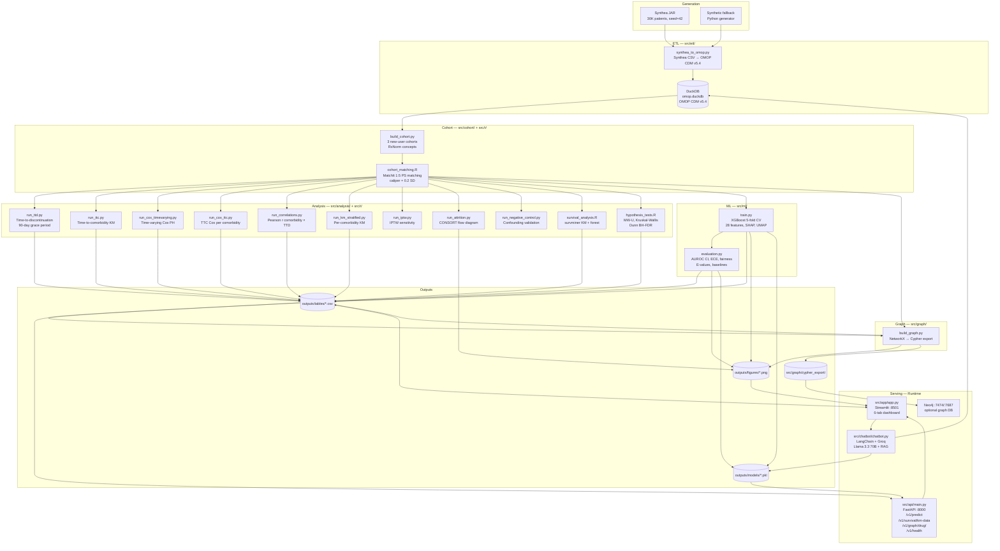

# System Architecture & Data Flow

## Table of Contents
1. [System Overview](#1-system-overview)
2. [Component Map](#2-component-map)
3. [Data Flow](#3-data-flow)
4. [Pipeline Sequence](#4-pipeline-sequence)
5. [Service Interactions (Runtime)](#5-service-interactions-runtime)
6. [Key Design Decisions](#6-key-design-decisions)
7. [Configuration & Environment](#7-configuration--environment)
8. [Directory Structure](#8-directory-structure)

---

## 1. System Overview

This is a **pharmacoepidemiology research pipeline** that generates synthetic T2DM patient data, runs a full comparative effectiveness analysis, trains a clinical ML model, and serves the results through a REST API and interactive dashboard.

It operates in two modes:

| Mode | Entry Point | Purpose |
|---|---|---|
| **Batch** | `bash scripts/bootstrap.sh` | End-to-end pipeline: ETL → cohort → analysis → ML → outputs |
| **Serving** | `docker compose -f docker/docker-compose.yml up api app` | FastAPI inference service + Streamlit dashboard |

The pipeline produces all outputs; the serving layer consumes them. These are intentionally decoupled — the API and dashboard are read-only consumers of files written by the pipeline.

---

## 2. Component Map



---

## 3. Data Flow

### 3.1 Batch Pipeline (write path)

```
┌─────────────────────────────────────────────────────────────────────┐
│ LAYER 1 — Synthetic Data Generation                                  │
│                                                                       │
│  Synthea JAR (seed=42, 30K patients)                                 │
│    └── /data/synthea_output/*.csv                                    │
│         patients.csv, conditions.csv, medications.csv, ...           │
│                                                                       │
│  Fallback: Python generator (numpy RNG, seed=42)                     │
│    └── same schema, no external dependency                           │
└──────────────────────────┬──────────────────────────────────────────┘
                            │
                            ▼ synthea_to_omop.py
┌─────────────────────────────────────────────────────────────────────┐
│ LAYER 2 — OMOP CDM v5.4 (DuckDB)                                    │
│                                                                       │
│  /data/omop/omop.duckdb                                              │
│    person              ← patients.csv + concept mappings             │
│    observation_period  ← enrollment windows                          │
│    drug_exposure        ← medications.csv + RxNorm concept IDs       │
│    condition_occurrence ← conditions.csv + SNOMED concept IDs        │
│    visit_occurrence     ← encounters.csv                             │
│    concept              ← minimal OHDSI Athena vocabulary            │
└──────────────────────────┬──────────────────────────────────────────┘
                            │
                            ▼ build_cohort.py
┌─────────────────────────────────────────────────────────────────────┐
│ LAYER 3 — Cohort Construction                                        │
│                                                                       │
│  Inclusion:  age ≥ 18, T2DM ≥ 1 day pre-index,                      │
│              ≥ 1 encounter in 12-month pre-index window,             │
│              ≥ 90-day follow-up post-index                           │
│  Exclusion:  T1DM, gestational DM, ESRD, prior antidiabetic use     │
│  New-user:   first dispensing, 365-day drug-class washout            │
│  Cohorts:    A=Metformin (17,928)  B=GLP-1 RA (5,955)               │
│              C=SGLT-2i  (6,117)                                      │
│                                                                       │
│  → outputs/tables/cohort_baseline.csv    (one row per patient)       │
│  → outputs/tables/comorbidity_prevalence.csv                         │
└──────────────────────────┬──────────────────────────────────────────┘
                            │
                            ▼ cohort_matching.R  (MatchIt + cobalt)
┌─────────────────────────────────────────────────────────────────────┐
│ LAYER 4 — Propensity Score Matching                                  │
│                                                                       │
│  PS model:  logistic regression on age, sex, CCI, 15 comorbidities  │
│  Method:    1:5 nearest-neighbor, caliper = 0.20 SD of logit(PS)    │
│  Balance:   SMD < 0.10 on all covariates post-match (cobalt)        │
│  Outputs:   love plot, PS overlap histogram                          │
│                                                                       │
│  → outputs/tables/cohort_matched.csv     (analysis-ready dataset)   │
└──────────┬──────────────────────────┬───────────────────────────────┘
           │                          │
           ▼ Analysis scripts         ▼ train.py
┌──────────────────────┐   ┌──────────────────────────────────────────┐
│ LAYER 5 — Statistics │   │ LAYER 6 — Machine Learning               │
│                      │   │                                           │
│ TTD events           │   │ Cohort restriction: ≥ 365-day follow-up  │
│ TTC KM curves        │   │   (required for 1-year binary label)     │
│ Cox PH (time-fixed)  │   │                                           │
│ Cox PH (time-varying)│   │ Feature engineering (28 features):       │
│ TTC Cox              │   │   demographics, drug one-hot, CCI,       │
│ Pearson correlations │   │   comorbidity burden, interaction terms, │
│ Stratified KM        │   │   15 binary comorbidity flags            │
│ Hypothesis tests     │   │                                           │
│ IPTW sensitivity     │   │ Removed (leakage): followup_days,        │
│ Negative controls    │   │   drug_class_num, sex_male               │
│ CONSORT attrition    │   │                                           │
│                      │   │ XGBoost 5-fold stratified CV             │
│ → outputs/tables/    │   │ SHAP TreeExplainer                       │
│ → outputs/figures/   │   │ UMAP on leaf embeddings                  │
└──────────────────────┘   │ Fairness: subgroup AUC (sex, age, drug) │
                           │ E-values: unmeasured confounding         │
                           │                                           │
                           │ → outputs/models/xgb_discontinuation.pkl │
                           │ → outputs/tables/ml_metrics.csv          │
                           │ → outputs/figures/shap_*.png             │
                           └──────────────────────────────────────────┘
```

### 3.2 Serving Layer (read path)

```
outputs/models/xgb_discontinuation.pkl ──┐
outputs/tables/ttd_events.csv            ├──► FastAPI :8000
outputs/tables/cox_ttd_results.csv       │      POST /v1/predict/discontinuation
                                         │      GET  /v1/survival/km-data
                                         │      GET  /v1/graph/drug/{class}
                                         │      GET  /v1/health
outputs/tables/*.csv  ───────────────────┤
outputs/figures/*.png ───────────────────┼──► Streamlit :8501
                                         │      Tab 1: Overview
FastAPI :8000         ───────────────────┘      Tab 2: Cohort
                                                Tab 3: Survival
                                                Tab 4: ML
                                                Tab 5: Graph
                                                Tab 6: Chatbot

PROTOCOL.md + README.md + outputs/tables/*.csv
  └──► FAISS vectorstore (sentence-transformers/all-MiniLM-L6-v2)
         └──► LangChain retriever
                └──► Groq API (Llama 3.3 70B)
                       └──► Chatbot responses with cited sources
```

---

## 4. Pipeline Sequence

`bootstrap.sh` executes 15 ordered steps. Each step is idempotent — re-running after failure picks up from where it left off.

| Step | Script | Output |
|---|---|---|
| 1 | Synthea / fallback generator | `data/synthea_output/*.csv` |
| 2 | `src/etl/synthea_to_omop.py` | `data/omop/omop.duckdb` |
| 3 | `src/cohort/build_cohort.py` | `cohort_baseline.csv` |
| 4 | `src/r/cohort_matching.R` | `cohort_matched.csv`, love plots |
| 5 | `src/analysis/run_ttd.py` | `ttd_events.csv`, KM figure |
| 6 | `src/analysis/run_ttc.py` | `ttc_summary.csv`, KM grids |
| 7 | `src/analysis/run_cox_timevarying.py` | `cox_timevarying_results.csv` |
| 8 | `src/analysis/run_cox_ttc.py` | `cox_ttc_results.csv` |
| 9 | `src/analysis/run_correlations.py` | `correlations.csv`, heatmap |
| 10 | `src/analysis/run_km_stratified.py` | `km_stratified_summary.csv` |
| 11a | `src/r/survival_analysis.R` | forest plots, Schoenfeld residuals |
| 11b | `src/r/hypothesis_tests.R` | `kruskal_results.csv`, `dunn_posthoc.csv` |
| 12 | `src/ml/train.py` | `xgb_discontinuation.pkl`, SHAP figures |
| 12b | `src/analysis/run_iptw.py` | IPTW sensitivity results |
| 12c | `src/analysis/run_attrition.py` | CONSORT attrition diagram |
| 12d | `src/analysis/run_negative_control.py` | negative control results |
| 13 | `src/graph/build_graph.py` | `knowledge_graph.png`, Cypher files |
| 14 | `scripts/report_formatter.pl` | `outputs/study_report.txt` |
| 15 | `src/app/app.py` | Streamlit dashboard on :8501 |

---

## 5. Service Interactions (Runtime)

```
┌──────────────────────────────────────────────────────────────────┐
│                         docker compose                           │
│                                                                  │
│  ┌─────────────────┐     HTTP :8000      ┌──────────────────┐   │
│  │  Streamlit App  │ ──────────────────► │   FastAPI API    │   │
│  │  :8501          │ ◄────────────────── │   :8000          │   │
│  │                 │   JSON responses    │                  │   │
│  │  6 tabs:        │                     │  Loads at start: │   │
│  │  overview       │                     │  xgb model (pkl) │   │
│  │  cohort         │                     │  ttd_events.csv  │   │
│  │  survival       │                     │  cox_results.csv │   │
│  │  ML             │                     │                  │   │
│  │  graph          │                     │  SHAP per-request│   │
│  │  chatbot ──────────────────────────────────────────────► │   │
│  └─────────────────┘                     └──────────────────┘   │
│         │                                                        │
│         │ Groq API (HTTPS)                                       │
│         ▼                                                        │
│  ┌─────────────────┐     Bolt :7687      ┌──────────────────┐   │
│  │  Groq Cloud     │                     │  Neo4j (opt.)    │   │
│  │  Llama 3.3 70B  │                     │  :7474 / :7687   │   │
│  │                 │                     │                  │   │
│  │  RAG over:      │                     │  Import from:    │   │
│  │  PROTOCOL.md    │                     │  nodes.cypher    │   │
│  │  README.md      │                     │  edges.cypher    │   │
│  │  outputs/tables │                     │                  │   │
│  │  omop.duckdb    │                     │  Fallback:       │   │
│  └─────────────────┘                     │  NetworkX only   │   │
│                                          └──────────────────┘   │
└──────────────────────────────────────────────────────────────────┘

External dependency: Groq API requires GROQ_API_KEY in .env
Neo4j is optional — graph module falls back to NetworkX in-process
```

### API Endpoints

| Method | Path | Description |
|---|---|---|
| `GET` | `/v1/health` | Liveness + readiness (model loaded, data available) |
| `POST` | `/v1/predict/discontinuation` | 1-year discontinuation risk, risk tier, top SHAP drivers |
| `GET` | `/v1/survival/km-data` | KM persistence curves (30-day intervals, Greenwood CI) |
| `GET` | `/v1/graph/drug/{drug_class}` | Drug mechanism, cardiorenal benefits, Cox HR vs metformin |

### Request / Response (prediction endpoint)

```
POST /v1/predict/discontinuation
Content-Type: application/json

{
  "age_at_index": 62.0,      "sex_female": 1,
  "drug_glp1": 1,             "drug_metformin": 0,  "drug_sglt2": 0,
  "cci": 3.0,                 "comorbidity_count": 4,
  "days_since_t2dm_dx": 1095, "age_over65": 0,
  "glp1_x_codx": 4.0,        "glp1_x_cci": 3.0,
  "sglt2_x_codx": 0.0,       "sglt2_x_cci": 0.0,
  "hypertension": 1,          "obesity": 1,
  "ckd": 1,                   "heart_failure": 0,
  ... (15 comorbidity flags total)
}

→ 200 OK
{
  "discontinuation_probability": 0.7823,
  "risk_tier": "high",
  "model_version": "xgb-v2.0-28feat",
  "top_risk_drivers": ["ckd", "glp1_x_cci", "days_since_t2dm_dx"]
}
```

---

## 6. Key Design Decisions

### DuckDB over PostgreSQL
The pipeline runs without any server infrastructure. DuckDB is embedded, columnar, and reads directly from Pandas DataFrames and Parquet without serialisation overhead. It supports the full OMOP CDM v5.4 schema and executes analytic SQL at speeds comparable to Redshift for this data size. If the study is later replicated against real EHR data in a hospital warehouse (Snowflake, BigQuery, Databricks), the SQL queries in `build_cohort.py` require zero changes — only the connection string changes.

### OMOP CDM as the data contract
Every concept ID in the pipeline is an OHDSI Athena standard concept (RxNorm for drugs, SNOMED for conditions). This is the difference between a research project and a reproducible study: a collaborator at another institution can point this pipeline at their OMOP warehouse and run the same analysis without any ETL customisation.

### R for survival analysis, Python for ML
`survminer`, `MatchIt`, and `cobalt` are the reference implementations for their methods in pharmacoepidemiology. Rewriting them in Python (lifelines, sklearn) would introduce method-level divergence that peer reviewers would flag. Python handles everything that R has no advantage in: ETL, ML, API, dashboard, graph. R handles everything that Python's survival ecosystem does not match: publication-quality KM plots, PS matching with cobalt balance diagnostics, competing risks (cmprsk).

### FastAPI decoupled from Streamlit
The inference service is a separate process on a separate port. This means:
- A mobile EHR integration, a Jupyter notebook, or a hospital's clinical decision support system can call `/v1/predict/discontinuation` independently of the dashboard
- The dashboard can be swapped (React, Dash, Tableau) without touching the model serving layer
- The API can be scaled horizontally behind a load balancer while the dashboard remains single-instance

### XGBoost over deep learning
Three reasons specific to this problem: (1) SHAP `TreeExplainer` gives exact Shapley values in O(TLD) — deep learning attribution methods (Integrated Gradients, LIME) are approximations. Clinical ML requires exact attribution for regulatory submissions. (2) Shallow trees (`max_depth=4`) with strong L1/L2 regularisation produce calibrated probabilities without post-hoc isotonic regression, which matters because the output is a risk score used for clinical stratification. (3) Training time is seconds on CPU, which matters for reproducibility in a resource-constrained research environment.

### 28 features — leakage removal rationale
Three features were removed after leakage audit:
- `followup_days` — in Synthea, `obs_end = discontinuation_date + Uniform(120, 300)`. This makes `followup_days` a near-deterministic function of the outcome (Pearson r = 0.972 in initial runs). The model was learning the data generation mechanism, not patient biology.
- `drug_class_num` — ordinal encoding of the drug class alongside the three one-hot columns. Redundant, inflates SHAP importance artificially.
- `sex_male` — perfectly collinear with `sex_female`. VIF → ∞, adds zero information.

### Frozen hyperparameters
No grid search was performed on the synthetic data. Tuning hyperparameters to maximise AUROC on Synthea output would optimise for the synthetic data generator's internal logic, not for real patient biology. The hyperparameters (`max_depth=4`, `learning_rate=0.05`, L1/L2 regularisation) were chosen based on domain priors for clinical tabular data and fixed before running CV.

### 1:5 PS matching over 1:1
GLP-1 RA and SGLT-2i initiators are outnumbered ~3:1 by metformin initiators in the raw cohort. 1:5 matching retains more treated patients, reducing variance in the survival estimates. Sensitivity analyses at 1:1 and 1:3 ratios are included in `notebooks/06_sensitivity_analyses.ipynb` to verify that results are not matching-ratio dependent.

### Groq (Llama 3.3 70B) over OpenAI
The chatbot uses three RAG channels: FAISS semantic retrieval over study documents, direct DuckDB SQL for data queries, and XGBoost for predictions. Groq's free inference tier provides the speed needed for interactive Q&A. The `sentence-transformers/all-MiniLM-L6-v2` embedding model runs locally — no API key required for the retrieval layer, only for generation.

---

## 7. Configuration & Environment

All pipeline constants flow from `config.py`. No script hardcodes a path or hyperparameter.

```python
# Single import pattern used across all scripts
from config import PATHS, COHORT, ML, MLFLOW, API_CFG

PATHS.omop_db          # overridable via OMOP_DB_PATH env var
PATHS.ensure_dirs()    # creates outputs/ subdirectories on first run
ML.FEATURE_COLS        # 28-element tuple — single source of truth for
                       # both train.py and api/main.py
```

### Required environment variables

| Variable | Required | Description |
|---|---|---|
| `GROQ_API_KEY` | Yes (chatbot) | Groq API key for Llama 3.3 70B |
| `OMOP_DB_PATH` | No | Override DuckDB path for containerised/HPC environments |
| `ALLOWED_ORIGINS` | No | Comma-separated CORS origins for the API (default: `http://localhost:8501`) |
| `API_HOST` / `API_PORT` | No | FastAPI bind address (defaults: `0.0.0.0:8000`) |
| `MLFLOW_TRACKING_URI` | No | Remote MLflow server URI (defaults to local `./mlruns/`) |
| `NEO4J_USER` / `NEO4J_PASSWORD` | No (Neo4j only) | Graph DB credentials |

Copy `config/.env.template` → `.env` and populate before running.

---

## 8. Directory Structure

```
.
├── config.py                   # All constants, paths, hyperparameters
├── pyproject.toml              # ruff + pytest configuration
├── requirements.txt            # Runtime dependencies (pinned)
├── requirements-dev.txt        # Dev dependencies: jupyter, ruff, pytest
│
├── config/
│   └── .env.template           # Environment variable reference (copy → .env)
│
├── docker/
│   ├── docker-compose.yml      # api + app + neo4j services
│   ├── Dockerfile.api          # FastAPI container (python:3.11-slim-bookworm)
│   └── Dockerfile.app          # Streamlit container (python:3.11-slim-bookworm)
├── .dockerignore               # Build context exclusions (must stay at root)
│
├── src/
│   ├── api/                    # REST inference service (FastAPI)
│   │   ├── main.py             # Endpoints, lifespan model loading
│   │   └── schemas.py          # Pydantic request/response models
│   ├── app/                    # Interactive dashboard (Streamlit, 6 tabs)
│   ├── analysis/               # 9 Python analysis scripts
│   ├── chatbot/                # LangChain + Groq + FAISS RAG
│   ├── cohort/                 # Cohort construction from OMOP
│   ├── etl/                    # Synthea CSV → OMOP DuckDB
│   ├── graph/                  # NetworkX graph + Cypher export
│   ├── ml/                     # XGBoost training + evaluation suite
│   └── r/                      # R scripts: matching, survival, hypothesis tests
│
├── tests/                      # 37 unit + integration tests
│   ├── conftest.py             # Session-scoped fixtures (synthetic data)
│   ├── test_api.py             # FastAPI endpoint tests (stub model)
│   ├── test_evaluation.py      # evaluation.py statistical function tests
│   └── test_feature_engineering.py  # build_features() leakage guard tests
│
├── notebooks/                  # 7 analysis notebooks (EDA → sensitivity)
├── scripts/
│   ├── bootstrap.sh            # 15-step end-to-end pipeline runner
│   └── report_formatter.pl     # Plain-text study report from CSV outputs
│
├── data/
│   ├── omop/omop.duckdb        # OMOP CDM database (gitignored)
│   ├── reference/codx_mapping.xlsx  # SNOMED comorbidity concept mapping
│   └── synthea_output/         # Synthea CSV files (gitignored)
│
├── outputs/                    # All generated artefacts (gitignored except models)
│   ├── models/                 # xgb_discontinuation.pkl, xgb_model.ubj
│   ├── tables/                 # CSV results (gitignored)
│   └── figures/                # PNG plots (gitignored)
│
├── .github/workflows/ci.yml    # Python 3.11 lint + test, R 4.3 package check
├── PROTOCOL.md                 # Pre-specified study protocol (STaRT-RWE)
└── ARCHITECTURE.md             # This document
```

---

*Generated from codebase inspection — reflects actual implementation, not aspirational design.*
